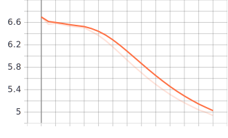
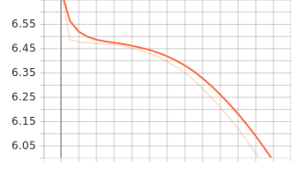
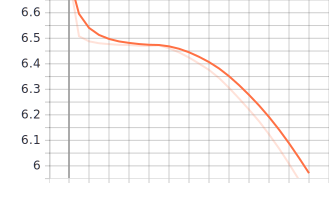
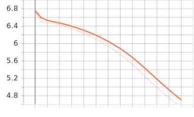

# Отчет по лабораторной работе "Генерация последовательностей"

### Лисовский Олег Романович, М8О-308Б-17
Номер в группе: 10, Вариант: 4 ((остаток от деления (XX-1) на 6)+1)

### Цель работы

В данной лабораторной работе вам предстоит научиться генерировать последовательности с помощью рекуррентных нейронных сетей. 

### Используемые входные данные

В качестве входных данных использовались несколько англоязычных книг: Tresure Island
Были так же попытки добавить English Fairy Tales, Grimm's fairy Stories, но мощностей моего компьтера не хватило. 

### Предварительная обработка входных данных

Загружаем все файлы с расширением .txt и создаём из них список. Создаём из них два словаря. Далее вычисляем
паттерны и нормализуем их.

### Эксперимент 1: RNN

#### Архитектура сети

Главное отличие рекуррентных нейронных сетей от других - наличие обратных связей. Иначе говоря создаются копии слоя
и в них поступают результаты работы этого же слоя. Благодаря этому они способны запоминать контекст, что необходимо для
работы с текстами. Чтобы лучше понять принцип работы RNN, перечитайте этот абзац.

#### Результат

" dangerous nor did it greatly gall me when i used my arm then i looked around me and as the ship was now in a sense my own i began to think of clearing it from its last passenger the dead man o'brien he had pitched as i have said against the bulwarks where he lay like some horrible ungainly "

interior the puppet the the the the ” ” are the ” unfort'nate ” ” said ” said ” ” cried the ” said ” ” said ” ” ” ” said ” ” said ” ” ” ” ” ” ” said ” replied the ” ” ” ” said ” ” cried the ” said ” ” said ” said ” ” said ” ” said ” ” ” ” ” said ” said ” ” said ” ” said ” said ” ” ” ” ” said ” ” said ” ” said ” said ” ”

#### Вывод по данному эксперименту

### Эксперимент 2: Однослойная LSTM

#### Архитектура сети

Является достаточно мощной модификацией рекуррентных сетей. Внутрь слоя добавляется 3 так называемых вентиля (забвения,
входной и выходной), которые сильно влияют на состояние ячейки, благодаря которому осуществляются операции с информацией и
как она будет выглядеть на выходе из ячейки. 

#### Результат

" the wind's eye but i'll tell you i was sober i was on'y dog tired and if i'd awoke a second sooner i'd a caught you at the act i would he wasn't dead when i got round to him not he ” “well ” says captain smollett as cool as can be all that silver said was a riddle "

the the the the the the the the the the the ” ” ” ” ” ” ” ” ” ” ” ” ” ” ” ” ” ” ” ” ” ” ” ” ” ” ” ” ” ” ” ” ” ” ” ” ” ” ” ” ” ” ” ” ” ” ” ” ” ” ” ” ” ” ” ” ” ” ” ” ” ” ” ” ” ” ” ” ” ” ” ” ” ” ” ” ” ” ” ” ” ” ” ” ” ” ” ” ”

#### Вывод по данному эксперименту

### Эксперимент 3: Двухслойная LSTM

#### Архитектура сети

Является по сути той же самой LSTM сетью, но со вторым слоем.

#### Результат

" rules i do i won't hurt a depytation ” thus encouraged the buccaneer stepped forth more briskly and having passed something to silver from hand to hand slipped yet more smartly back again to his companions the sea cook looked at what had been given him “the black spot i thought so ” he observed “where might you have got "

” ” ” said ” said ” said ” said ” captain the captain ” he the captain ” he the captain ” he the captain ” he the captain ” he the captain ” he the captain ” he the captain ” he the ” ” ” said ” said ” said ” said ” said ” said ” said ” said ” said ” said ” said ” said ” said ” said ” said ” said ” said ” said ” said ” said ” said ” said ” said ” said ” said ” said ”

#### Вывод по данному эксперименту

### Эксперимент 4: GRU

#### Архитектура сети

Является модификацией LSTM, соответственно являясь ещё более технологичной модификацией RNN. Главное отличие от
LSTM сети заключается в том, что вентили забвения и входа объединяются в единый вентиль обновления.

#### Результат

" stay here a bit ” he continued “i'm a plain man rum and bacon and eggs is what i want and that head up there for to watch ships off what you mought call me you mought call me captain oh i see what you're at there” and he threw down three or four gold pieces on the threshold “you "

the ” the the ” says the doctor the ” the the “would the the doctor the the the the the the the the the the the the the the the the the the the the the the the the the the the the the the the the the the the the the the the forever “they're fourth the sp'iling blabbing forever amen you'd retorted you is the i the i the i the the the the feelings the the the the the the the the the the the the the the the the the the the the the the

#### Вывод по данному эксперименту

### Выводы

Самым быстрым оказалась RNN 
